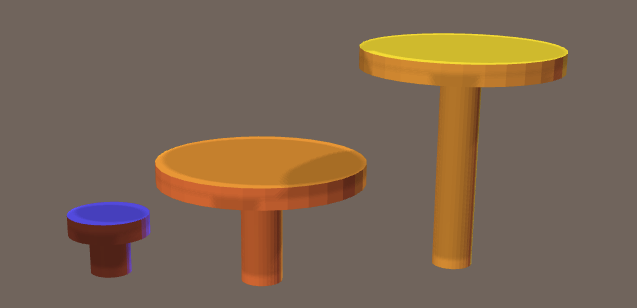

craft-pin
=========

Pin


# Install

    $ npm install craft-pin

# Example

```html
<craft>
    <craft name="pin" module="craft-pin">
    <pin height="5"></pin>
    <pin height="10" headRadius="4"></pin>    
</craft>
```	

